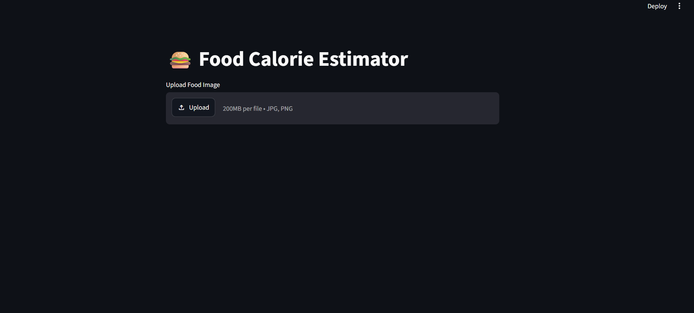
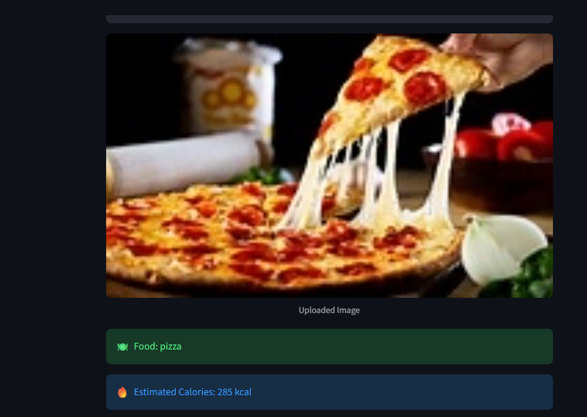
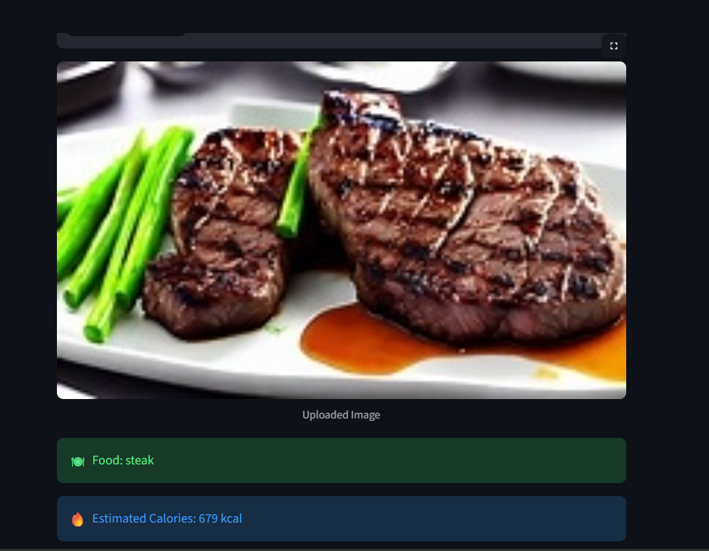

# 🍔 Food Calorie Estimator using Deep Learning

## 📌 Project Overview

The Food Calorie Estimator is a Deep Learning-based application that identifies food items from images and estimates their calorie content. The project uses MobileNetV2, a pre-trained Convolutional Neural Network (CNN), along with Transfer Learning to classify food images accurately.

Users can upload a food image through a Streamlit web interface and instantly receive:

* Food Category Prediction
* Estimated Calories
* Prediction Confidence Score

---

## 🚀 Features

* Food Image Classification
* Calorie Estimation
* Confidence Score Display
* Deep Learning-Based Prediction
* Transfer Learning with MobileNetV2
* User-Friendly Streamlit Interface

---

## 🛠️ Technologies Used

* Python
* TensorFlow / Keras
* MobileNetV2
* NumPy
* Pillow (PIL)
* Streamlit

---

## 🧠 Deep Learning Concepts Used

* Convolutional Neural Networks (CNN)
* Transfer Learning
* Image Classification
* Data Augmentation
* Fine-Tuning
* Softmax Classification

---

## 📂 Dataset Classes

The model is trained to recognize:

* Hamburger
* Ice Cream
* Pizza
* Steak
* Sushi

---

## 📁 Project Structure

food-calories-project/

├── app/

│ └── app.py

├── dataset/

│ └── mini-food/

├── models/

├── notebooks/

├── src/

│ └── train.py

├── food_mobilenetv2.h5

├── requirements.txt

└── README.md

---

## ⚙️ Installation

### Clone Repository

```bash
git clone https://github.com/Shrutisingh0104/food-calories-project.git
```

### Navigate to Project

```bash
cd food-calories-project
```

### Install Dependencies

```bash
pip install -r requirements.txt
```

### Run Application

```bash
streamlit run app/app.py
```

---

## 🎯 How It Works

1. User uploads a food image.
2. Image is preprocessed and resized.
3. MobileNetV2 model analyzes the image.
4. Predicted food category is generated.
5. Estimated calorie information is displayed.
6. Confidence score is shown to the user.

---

## 📊 Model Information

Model: MobileNetV2

Training Technique: Transfer Learning

Input Size: 224 × 224

Output Classes: 5 Food Categories

Framework: TensorFlow / Keras

---

## 🔮 Future Improvements

* Support for more food categories
* Real-time camera detection
* Nutritional information prediction
* Better calorie estimation
* Larger training dataset
* Mobile application deployment
## 📸 Screenshots

### Home Page



### Pizza Prediction



### Steak Prediction



---

## 👩‍💻 Author

Shruti Singh

CSE(AI&ML)

Deep Learning & Computer Vision Enthusiast
